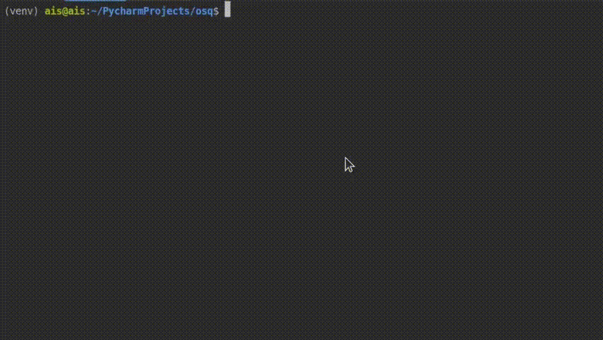

## Описание пректа

Реализация osquery-расширения для удаленных git репозиториев, позволяющего пользователю получать информацию о своих проектах.

## Задачи

- [x] 1. Получить список репозиториев
- [x] 2. Список веток для репозитория
- [x] 3. Список файлов для коммита
- [x] 4. Список тегов 
- [x] 5. Список субмодулей
- [ ] 6. Количество багов для измененных файлов

## Инструкция по запуску

Обязательным условием работы скриптов является наличие пакетного менеджера Pip.

Для установки всех необходимых пакетов, представленных в requirements.txt используются команды:

```ShellSession
$ pip install PyGithub
$ pip install plotly
$ pip install gitpython
```
## Использование скриптов для получения списка репозиториев и веток:



## Использование итогового файла для получения информации о проектах:


Список команд к файлу:
```ShellSession
$ Enter repo name: 
$ gumbo-parser
$ Get all branches in repo gumbo-parser:
$ Get repo for tags: 
$ http-parser
$ Get all tags in repo http-parser:
$ Get all commits in repository gumbo-parser:
$ Get repo for commits: 
$ kursach
$ count of commits:  17
$ last change:  ['README.md']
$ Get repo for subs: 
$ lab-04-boost-filesystem
```
## Полезные ссылки

- [Pip package manager](https://pypi.org/project/pip/)
- [PyGithub documentation](https://pygithub.readthedocs.io/en/latest/)
- [gitpython documentation](https://gitpython.readthedocs.io/en/stable/)
- [graph library python](https://plot.ly/python/)
- [osquery](https://osquery.io/)
- [about git](https://git-scm.com/)
- [github API's](https://developer.github.com/v3/libraries/)

